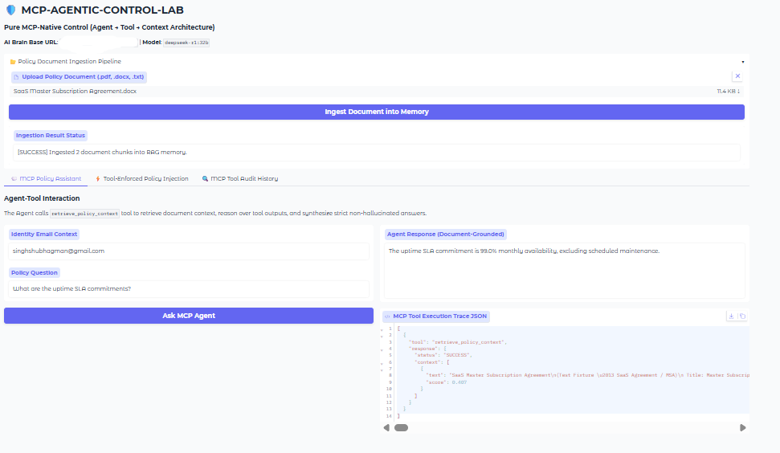
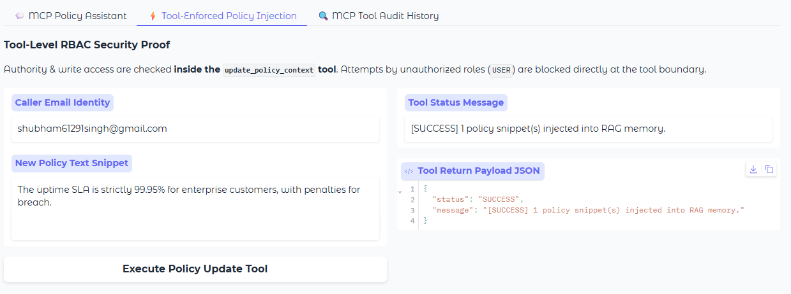
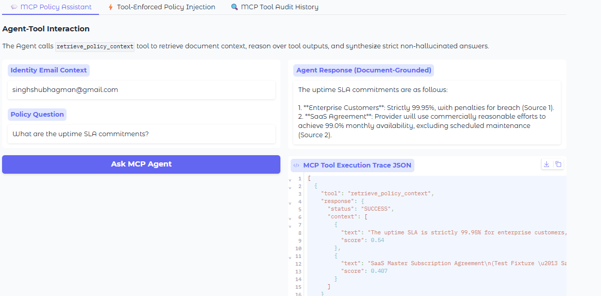
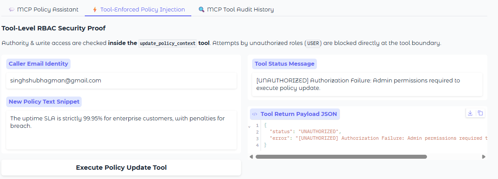
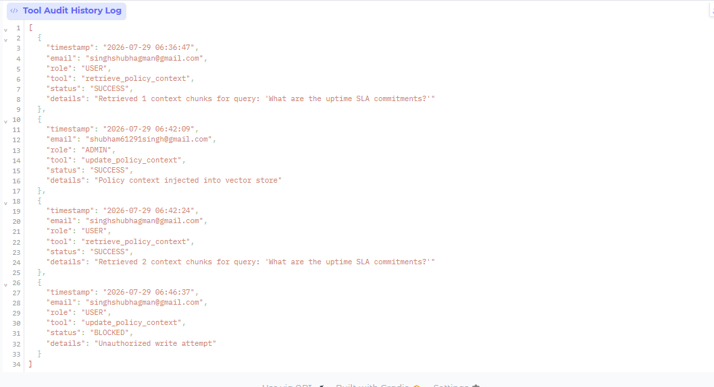

# 🛡️ MCP-AGENTIC-CONTROL-LAB

**Comparative Agentic RAG Architectures: MCP-Style vs MCP-Native Control**

---

## 📖 Overview

MCP-AGENTIC-CONTROL-LAB is a systems-engineering project that demonstrates two complete, working implementations of a role-based, document-grounded Retrieval-Augmented Generation (RAG) system—built using two fundamentally different control paradigms:

- **MCP-Style RAG** (UI-Orchestrated Control)
- **MCP-Native RAG** (Agent → Tool → Context Control)

Both systems solve the same enterprise problem:

- Policy document ingestion
- Role-based access control (Admin / User / Unknown)
- Secure policy updates
- Faithful, non-hallucinated answers
- Safe handling of missing information

The purpose of this repository is not to show “another RAG chatbot”.  
It exists to answer a deeper systems question:

> **Where should authority, trust, and control live in an agentic AI system?**

---

## 🧠 What This System Does

- **Conversational policy Q&A** – ask questions about uploaded policy documents and receive strictly document‑grounded answers.
- **Role‑based access** – Admins can read and write policy snippets; Users can only read; Unknown identities are denied.
- **Tool‑level authorization** – authority checks happen inside the retrieval/update tools, not in the UI layer.
- **Live audit trail** – every tool invocation (success, denial, retrieval results) is logged and visible in the UI.
- **Deterministic, non‑hallucinating answers** – the LLM is constrained to use only the retrieved document context.

---

## 🛡️ Design Principles

### ✅ Explicit Authority Placement
Authority is deliberately placed either in the UI (MCP-Style) or in tools (MCP-Native).

### ✅ Document-Faithful RAG
Answers are generated strictly from retrieved document context; no external web search is used for core Q&A.

### ✅ Safe Failure Modes
When information is missing, the system states so clearly instead of inventing an answer.

### ✅ Evidence-First Demonstration
All screenshots reflect real executions, not curated demos.

---

## 🚀 Key Capabilities

- Ingestion of PDF, DOCX, TXT documents into a persistent vector store.
- Semantic chunking and embedding with `all-MiniLM-L6-v2`.
- Retrieval‑augmented generation with a local GPU brain (DeepSeek‑R1 32B via Ollama) or OpenAI API fallback.
- MCP-Native tool server that enforces role‑based access inside `retrieve_policy_context` and `update_policy_context`.
- Gradio web interface with three tabs: ingestion, policy assistant, and audit log.
- Full audit logging with timestamps, user roles, and tool outcomes.

---

## 🧠 System Architecture
text'''
User (Browser)
│
▼
Gradio UI (app.py)
│
├─▶ MCP Agent (mcp_core/agent.py)
│ │
│ ├─▶ retrieve_policy_context tool (mcp_core/tools.py)
│ │ ├─▶ Authorization check (core/auth.py)
│ │ └─▶ Vector Store (ChromaDB / Pinecone / InMemory)
│ │
│ └─▶ LLM Brain (core/llm_brain.py) → Ollama / OpenAI
│
└─▶ update_policy_context tool (mcp_core/tools.py)
├─▶ Authorization check (Admin only)
└─▶ Vector Store write
'''

All components run inside a single Docker container (or locally), except Ollama which runs natively on the host for direct GPU access.

---

## 🛠 Tech Stack

| Component       | Technology                                      |
|-----------------|-------------------------------------------------|
| Language        | Python 3.10                                     |
| UI              | Gradio                                          |
| LLM Inference   | Ollama, DeepSeek‑R1 32B (GPU), OpenAI fallback   |
| Vector DB       | ChromaDB, Pinecone, InMemory                    |
| Embeddings      | `sentence-transformers/all-MiniLM-L6-v2`        |
| Auth            | Custom RBAC (email‑based)                       |
| Document Parsing| PyPDF2, python-docx                             |
| Deployment      | Docker, Docker Compose, GCP GPU VM              |

---

## 📂 Project Structure
'''bash
mcp-agentic-control-lab/
│── .env.example
│── docker-compose.yml
│── Dockerfile
│── requirements.txt
│── README.md
│── app.py # Gradio UI
│── mcp_native.py # Standalone MCP-Native script
│── config.py # Central configuration
│── core/
│ ├── auth.py # Role definitions & identity checks
│ ├── document_parser.py # PDF/DOCX/TXT extraction & chunking
│ ├── embeddings.py # SentenceTransformer engine
│ ├── vector_store.py # ChromaDB/Pinecone/InMemory stores
│ └── llm_brain.py # Unified LLM client (Ollama/OpenAI)
│── mcp_core/
│ ├── tools.py # MCP tool server (retrieve/update + audit)
│ └── agent.py # MCP Agent execution pipeline
└── screenshots/ # UI demonstration images
├── mcp1.png
├── mcp2.png
├── mcp3.png
├── mcp4.png
└── mcp5.png
'''

---

## 🧪 Step-by-Step System Demonstration (MCP-Native RAG)

All screenshots are taken from a live deployment on a GCP GPU VM, with a local DeepSeek‑R1 32B brain.

### 1️⃣ System Interface & Normal User Query
The user logs in with a registered email and asks a policy question.  
The Agent calls the `retrieve_policy_context` tool, obtains relevant document chunks, and generates a strict, document‑grounded answer.  

### 2️⃣ Admin Policy Injection (Authorized Write)
An admin (using a pre‑configured admin email) navigates to the “Tool‑Enforced Policy Injection” tab, enters a new policy snippet, and pushes it to the vector store.  
The tool verifies the admin role before accepting the update.  

### 3️⃣ Retrieval After Update (Proof of Dynamic Policy Change)
The same user (or any user) asks the same question again.  
The answer now reflects the newly injected policy clause, proving that the retrieval pipeline is dynamic and updated in real time.  

### 4️⃣ Unauthorized User Update Blocked (Tool‑Level Enforcement)
A non‑admin user attempts to inject a policy snippet.  
The `update_policy_context` tool detects the insufficient role and returns an “Unauthorized” error.  
The user is not allowed to modify the vector store.  

### 5️⃣ Tool Audit Log
The audit tab displays a timestamped log of every tool invocation.  
Each entry includes the user email, role, tool name, status (SUCCESS/BLOCKED), and details (e.g., number of retrieved chunks, unauthorized attempt).  
This provides a complete, transparent trail of all agent‑tool interactions.  

---

## ⚠️ Engineering Challenges & How They Were Solved

### ❌ Challenge 1: Silent Retrieval Failures
- **Issue:** The initial ingestion split the document into overly small chunks (256 tokens), causing key sections to be split or omitted entirely. Retrieval returned empty results for many natural‑language questions.
- **Fix:** Increased chunk size to 1200 tokens with 100‑token overlap. Entire sections (e.g., Section 4.1) are now stored as single chunks, dramatically improving retrieval recall.

### ❌ Challenge 2: Stringent Similarity Threshold
- **Issue:** The default retrieval threshold of 0.45 was too high for longer, semantically different queries (e.g., “uptime SLA commitments” vs the actual clause text).
- **Fix:** Lowered the threshold to 0.2 in the `retrieve_policy_context` tool. This allows relevant clauses with cosine similarity scores in the 0.3‑0.45 range to be retrieved, while still filtering out completely unrelated text.

### ❌ Challenge 3: Embedding Model Format Inconsistency
- **Issue:** The SentenceTransformer encoder sometimes returned a numpy array, sometimes a list, causing `.tolist()` errors and silent failures.
- **Fix:** Standardised the `encode` method in `core/embeddings.py` to always return a plain Python list.

### ❌ Challenge 4: Docker Networking
- **Issue:** The container could not reach the host’s Ollama at `localhost`.
- **Fix:** Used the Docker bridge IP `172.17.0.1` for `OLLAMA_URL` and added the `/v1` suffix for the OpenAI‑compatible endpoint.

---

## ⚠️ Limitations & Disclosure

- **No cross‑encoder reranking** – retrieval uses only cosine similarity.
- **No persistent session memory** – conversation history is lost on container restart.
- **LLM access requires a running Ollama instance** (or an OpenAI API key for fallback).
- **Chunk size is a trade‑off** – larger chunks improve recall but may include irrelevant text.
- **Screenshots reflect real, unfiltered outputs** – they are not cherry‑picked.

---

## ▶️ Usage

### Quick Start (Docker)

1. Clone and configure
cp .env.example .env
Edit .env and set ADMIN_EMAIL, USER_EMAIL, OLLAMA_URL (if needed)

2. Start the container
docker compose up -d --build

3. Access the UI
Open http://<your-vm-ip>:7860 in a browser

Local Execution (without Docker)

pip install -r requirements.txt
python app.py

## 👨‍💻 Author

Shubham Singh

## 📜 License

MIT License
